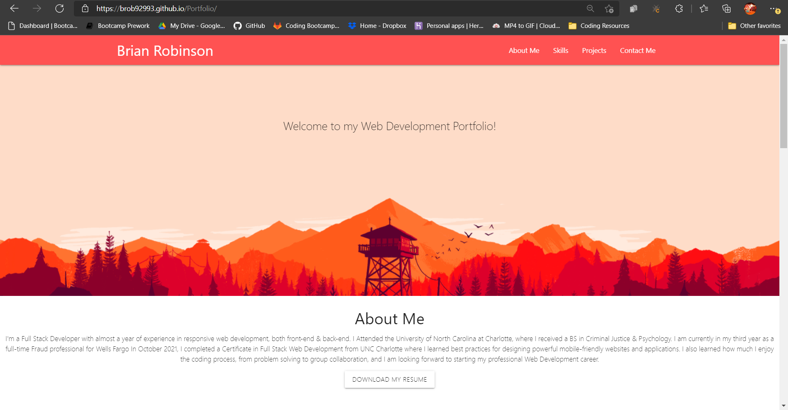
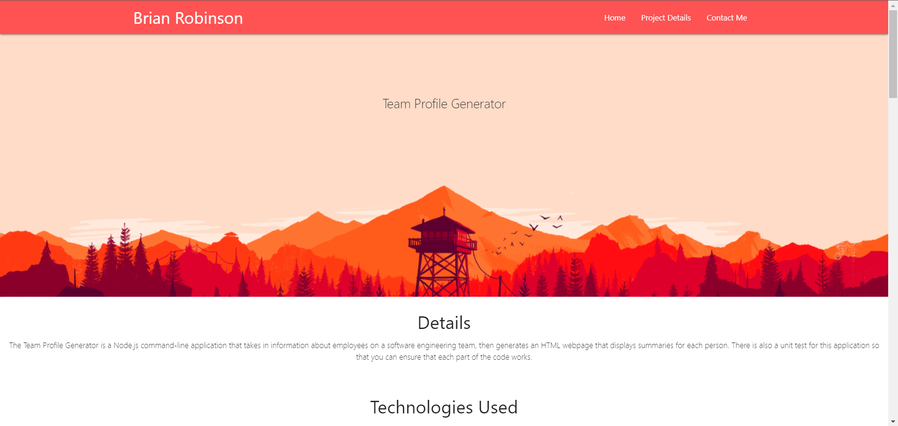

# Week2-Portfolio

My portfolio has an "About Me" section with general information about me, a "Projects" section with a box for each project. Each project has a background image, and if you click on the first project, you will see the live website that i refactored for last weeks homework. There is also a "Contact" section with links to my phone number, email, and Github Repository. The website is mobile, tablet, and desktop responsive as well. Please see the screenshots and link to the live website below.

[Live Website](https://brob92993.github.io/Week2-Portfolio/)
