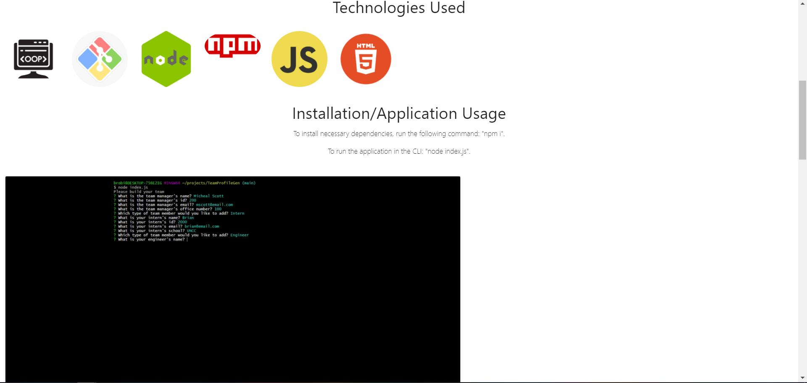

# Week2-Portfolio

My portfolio has an "About Me" section with general information about me, a "Projects" section with a link to details for each project, as well as a link to the application, a "Technologies" section that has logos of each technology learned, and a "Contact" section with links to my phone number, email, resume and Github Repository. The website is mobile, tablet, and desktop responsive as well. Please see the screenshots and link to my portfolio below.

[Live Website](https://brob92993.github.io/Portfolio/)
